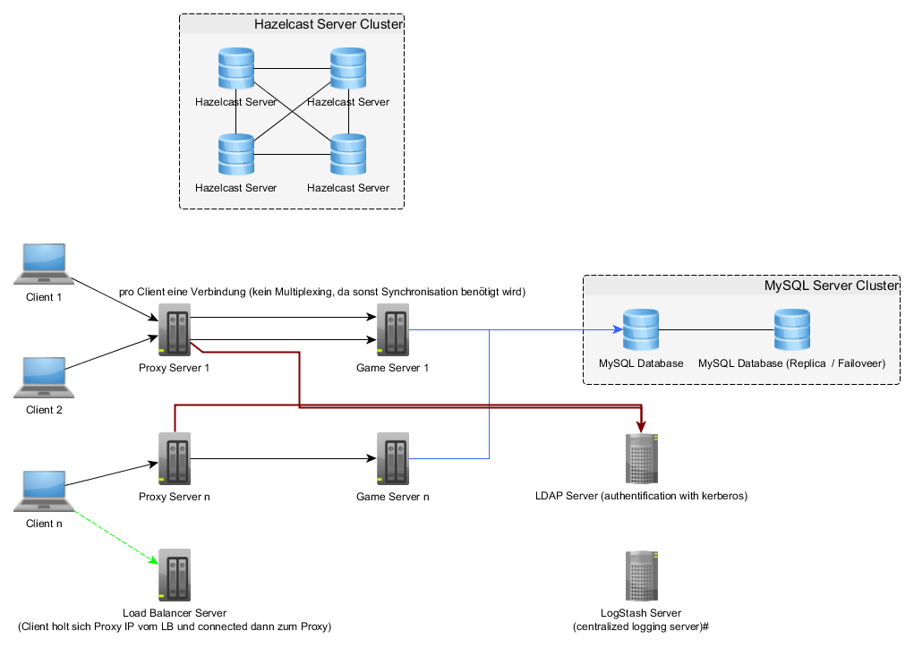
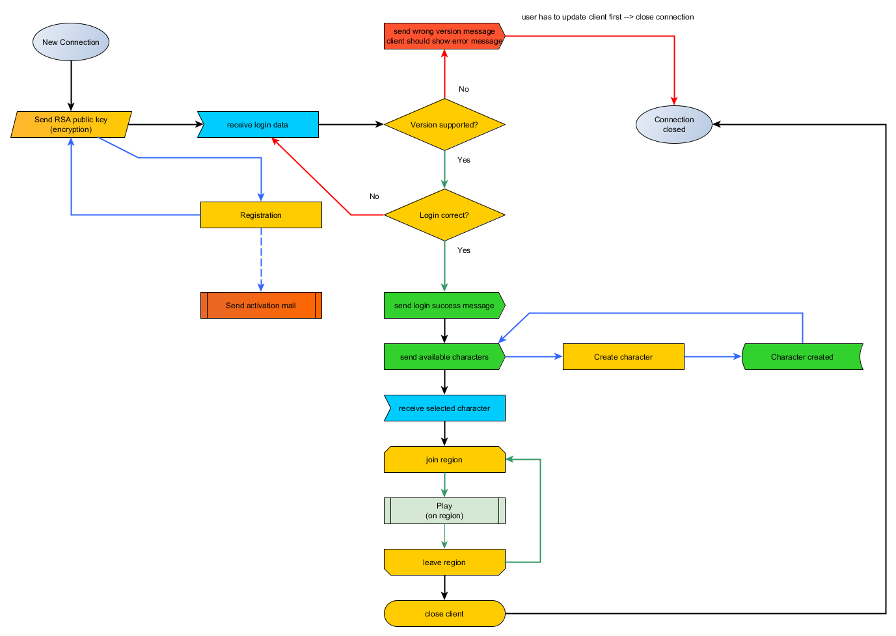
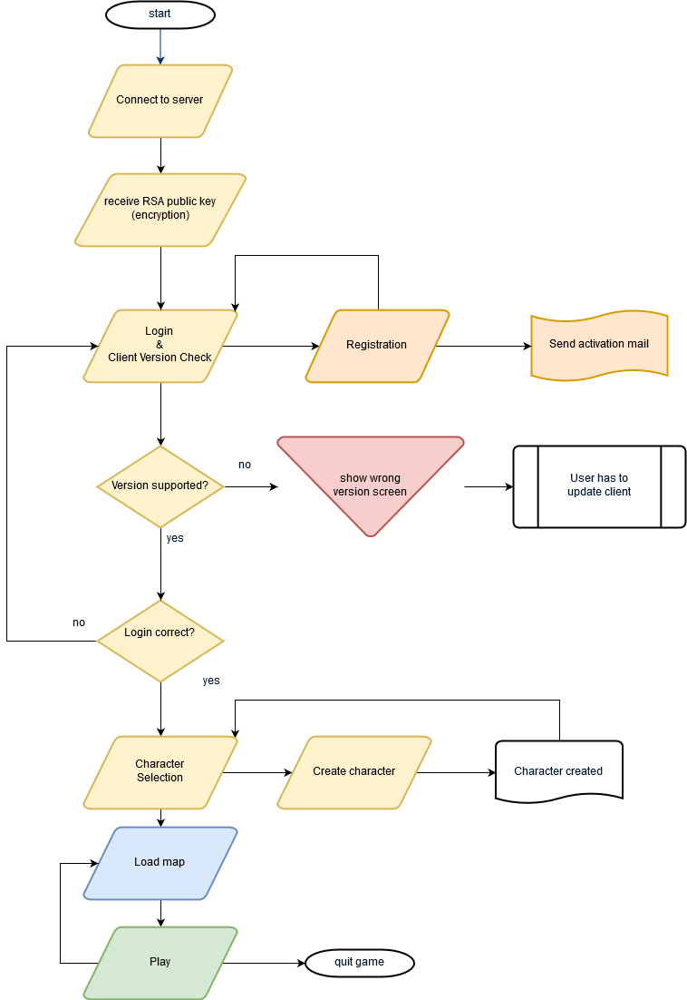
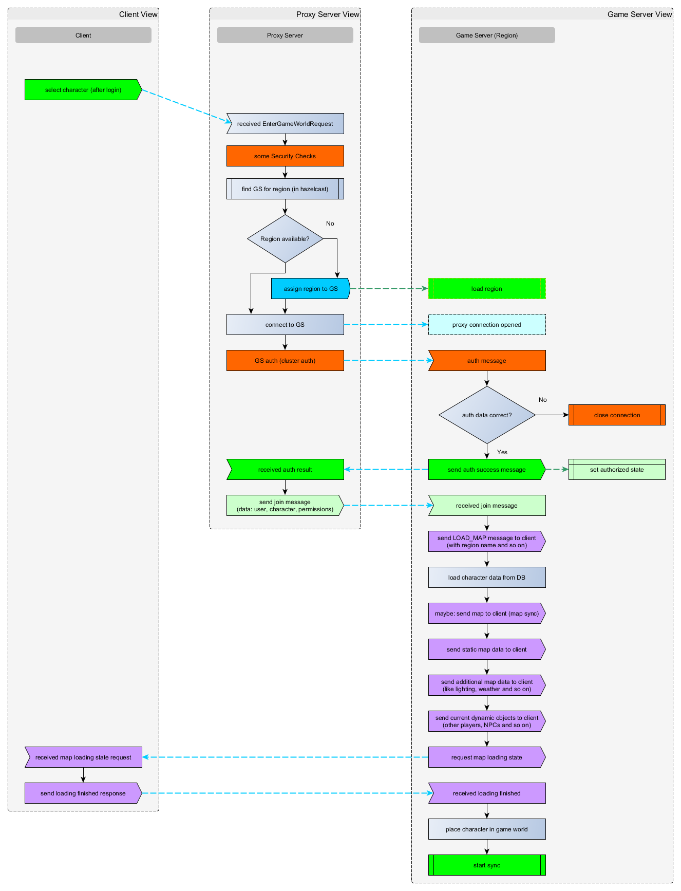

# mmo-proxy-2.0

Another try to build a mmo proxy server

 
 
 
 
 
 
 
 

Previous version: [mmo-proxy-server](https://github.com/JuKu/mmo-proxy-server)

## Server Architecture

## Changes to previous version

The previous version was partly over-engineered with many modules, now there is only one maven module again.
Also the network protocol & types has improved a little bit, because there was some things, they was difficult to implement.
The serialization method was completely reworked and improved to maintain the server easier. Also we introduced a new pileline model.
Additionally we have removed the "cid" field in network protocol, because it was completely redundant, every proxy - game server connection is for only one client on one region (we don't use multiplexing, because this causes new problems and isn't easy to perform very well).
And proxy isn't longer responsible for chat messages, anymore.
Also it is more independent from game server, they don't share the same database anymore.

## General Aspects

  - proxy server should be mostly transparent
  - pipeline model with filters for security
  - proxy is responsible for authentification (login & registration)
  - do as little as possible game logic in proxy server (like region join / leave)
  - do security completely on proxy server (also get permission roles / groups and send them via join message to game servers)
  
## Network Protocol

  - 1 integer package size (**will be removed from payload data**)
  - 1 byte type
  - 1 byte extendedType (will not be parsed by proxy server
  - 1 short (2 byte) version (protocol version)
  - payload data (redirected to game servers)

**Type 0x01 is reserved for client - proxy server communication** (authorization, encryption, character selection and so on).

## Reserved types

  - 0x01 authorization & initialization - client - proxy connection (login, registration, encryption, RTT, character selection and so on)
      * 0x01 send key pair
      
| **type**  | **extended type**  | **direction (client - proxy)**  | **description**   | **login required**  | **implemented?**  |
|---|---|---|---|---|---|
| **0x01**  | 0x01  | (2) client <--> proxy (1)  | request / send RSA public key to client, so he can encrypt login data  | -  | x  |
| 0x01  | 0x02  | (1) client <--> proxy (2)  | RTT - round trip time (message to determine client ping) | -  | x  |
| 0x01  | 0x03  | client <--> proxy  | login request / response (with login data and client version)  | -  | x  |
| 0x01  | 0x04  | client <--> proxy  | request / send character list  | x  | x  |
| 0x01  | 0x05  | client <--> proxy  | character creation  | x  | x  |
| 0x01  | 0x06  | client <--> proxy  | enter game world  | x  | x  |
| 0x01  | 0x07  | proxy --> region  | join region request & response  | x  | x  |
| 0x01  | 0x08  | proxy <-- region  | leave region message  | x  | -  |
| **0x02**  | 0x01  | proxy <-- region  | load map  | x  | x  |
| 0x02  | 0x02  | proxy --> region  | request some region client files to download  | x  | -  |

### Login Proxy --> Region Server

Open conenction to region server, send JOIN character message with following data (as json encrypted with RSA):

  - userID
  - username
  - cluster_user (for region auth)
  - cluster password (for region auth)
  - all permission roles / groups of user (from ldap, e.q. gamemaster)
  
## Flowchart

**server side**:\
\

From **client side**:\
\

## Join region - Flowchart

